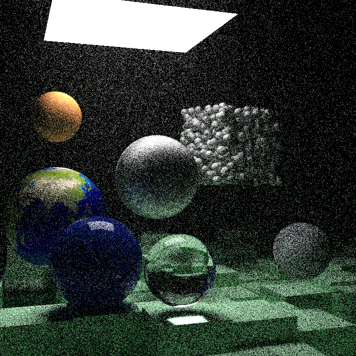
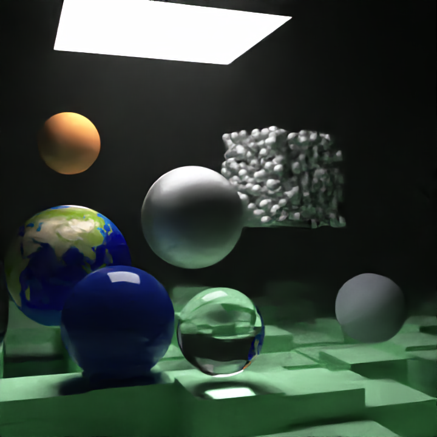

# Raytracer

 Raytracer strongly based on the series 
 [Raytracing in One Weekend](https://raytracing.github.io/books/RayTracingInOneWeekend.html).

## Features 

| Feature                          | Progress                                  |
|----------------------------------|-------------------------------------------|
| Raytraced primitive              | Done (Spheres, Triangles, Squares, Cubes) |
| Meshes                           | Done (Obj)                                |
| Multi-threading                  | Done (CPU)                                |
| Denoiser                         | Done                                      |
| PBR                              | Todo                                      |

## Results

After the first book, the result looked like this :

Rendered meshes (OBJ) :

BVH result (9s) :

Final scene (Raytracing : The next week) :

Denoise with OpenImageDenoise :

 

## Based on

[_ScratchaPixel_](https://www.scratchapixel.com/)

[_Ray Tracing in One Weekend_](https://raytracing.github.io/books/RayTracingInOneWeekend.html)

[_Ray Tracing: The Next Week_](https://raytracing.github.io/books/RayTracingTheNextWeek.html)

[_Ray Tracing: The Rest of Your Life_](https://raytracing.github.io/books/RayTracingTheRestOfYourLife.html)

[_ThreadPool_](https://vorbrodt.blog/2019/02/12/simple-thread-pool/)