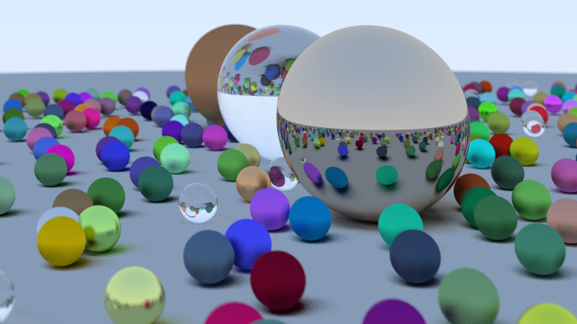
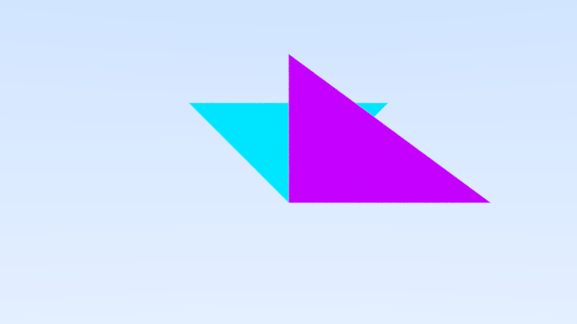

# Raytracer

 Raytracer strongly based on the series 
 [Raytracing in One Weekend](https://raytracing.github.io/books/RayTracingInOneWeekend.html).

## Features 

| Feature                          | Progress                  |
|----------------------------------|---------------------------|
| Raytraced primitive              | Done (Spheres, Triangles) |
| Meshes                           | Todo                      |
| Multi-threading                  | Todo                      |

## Results

After the first book, the result looked like this :

Rendered triangles :

