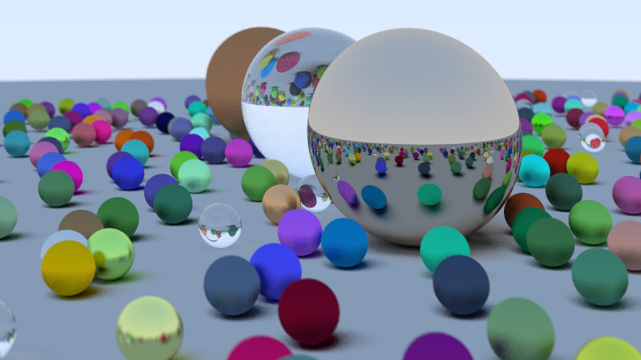
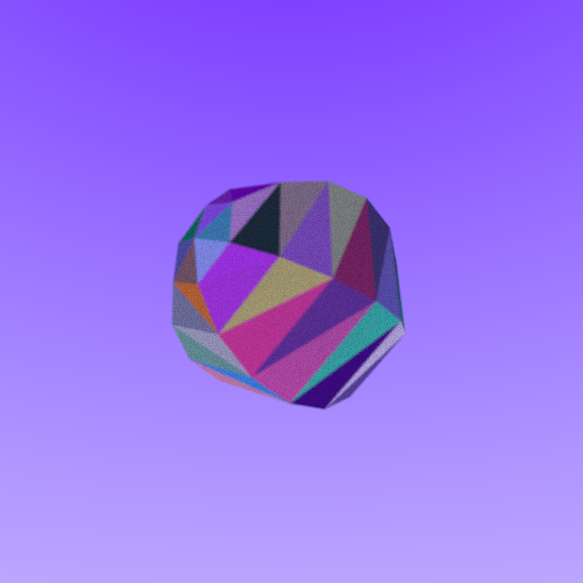
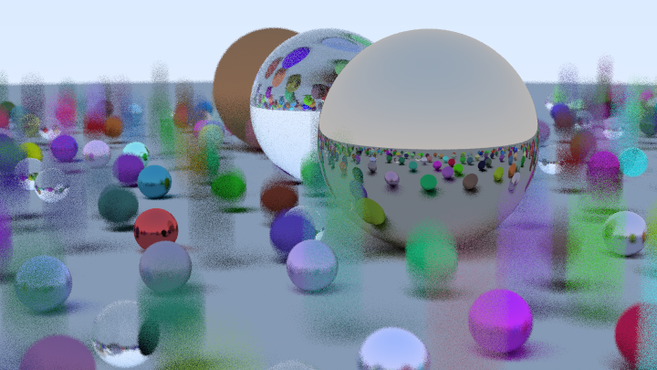
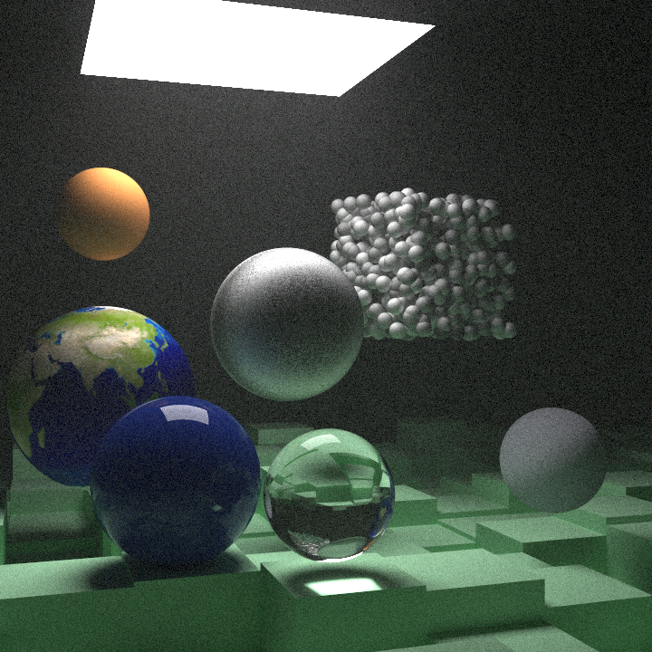

# Raytracer

 Raytracer strongly based on the series 
 [Raytracing in One Weekend](https://raytracing.github.io/books/RayTracingInOneWeekend.html).

## Features 

| Feature                          | Progress                  |
|----------------------------------|---------------------------|
| Raytraced primitive              | Done (Spheres, Triangles) |
| Meshes                           | Done (Obj)                |
| Multi-threading                  | Done (CPU)                |
| IsoSurface                       | Todo                      |
| Gpu                              | Todo                      |
| PBR                              | Todo                      |

## Results

After the first book, the result looked like this :

Rendered meshes (OBJ) :

BVH result (9s) :

Final scene (Raytracing : The next week) :

