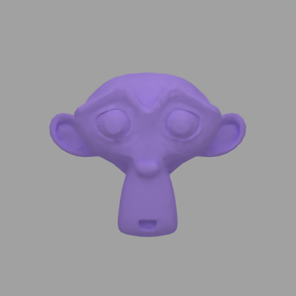
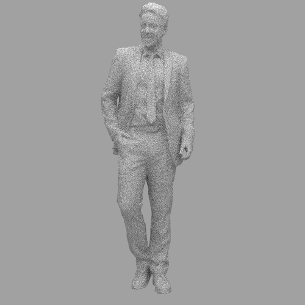

# Raytracer

 Raytracer strongly based on the series 
 [Raytracing in One Weekend](https://raytracing.github.io/books/RayTracingInOneWeekend.html).

## Features 

| Feature                          | Progress                                  |
|----------------------------------|-------------------------------------------|
| Raytraced primitive              | Done (Spheres, Triangles, Squares, Cubes) |
| Meshes                           | Done (Obj)                                |
| Multi-threading                  | Done (CPU)                                |
| Denoiser                         | Done                                      |

## Build

To enable the denoiser support you need to specify the OpenImageDenoise_DIR variable which
needs to point on a folder in your OpenImageDenoise installation that contains `OpenImageDenoiseConfig.cmake`.

```sh
    git clone https://github.com/PlathC/Raytracer.git
    mkdir build && build
    cmake ..
    cmake build .
```

## Results

Mesh Loader and denoiser :







Last scene of _Ray Tracing: The Rest of Your Life_ :


## Based on

[_ScratchaPixel_](https://www.scratchapixel.com/)

[_Ray Tracing in One Weekend_](https://raytracing.github.io/books/RayTracingInOneWeekend.html)

[_Ray Tracing: The Next Week_](https://raytracing.github.io/books/RayTracingTheNextWeek.html)

[_Ray Tracing: The Rest of Your Life_](https://raytracing.github.io/books/RayTracingTheRestOfYourLife.html)

[_ThreadPool_](https://vorbrodt.blog/2019/02/12/simple-thread-pool/)